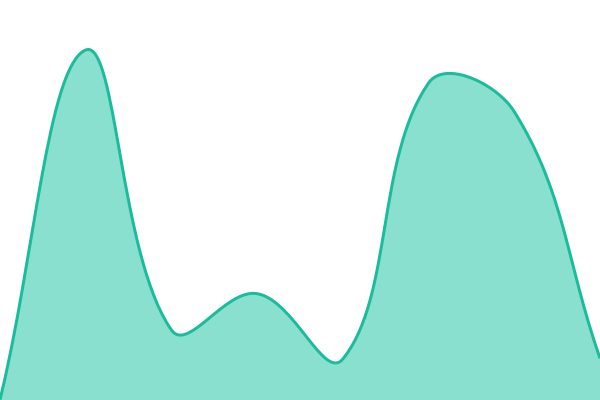
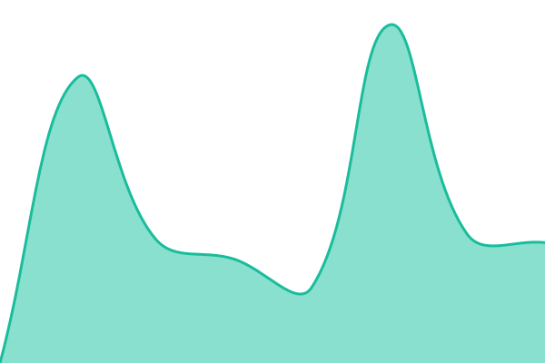
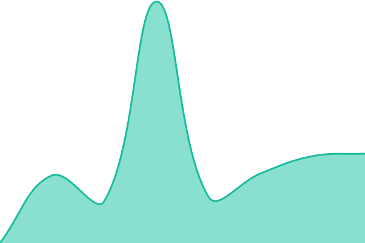

# [📈 Live Status](https://demo.upptime.js.org): <!--live status--> **🟧 Partial outage**

This repository contains the open-source uptime monitor and status page for [Upptime](https://upptime.js.org), powered by [Upptime](https://github.com/upptime/upptime).

With [Upptime](https://upptime.js.org), you can get your own unlimited and free uptime monitor and status page, powered entirely by a GitHub repository. We use [Issues](https://github.com/upptime/upptime/issues) as incident reports, [Actions](https://github.com/upptime/upptime/actions) as uptime monitors, and [Pages](https://demo.upptime.js.org) for the status page.

<!--start: status pages-->
<!-- This summary is generated by Upptime (https://github.com/upptime/upptime) -->
<!-- Do not edit this manually, your changes will be overwritten -->
<!-- prettier-ignore -->
| URL | Status | History | Response Time | Uptime |
| --- | ------ | ------- | ------------- | ------ |
|  [Bsb fortrade website](https://bsbfortrade.com/assets/images/Logo_bsb_white.webp) | 🟩 Up | [bsb-fortrade-website.yml](https://github.com/durgeshbsb/uptime_bsb/commits/HEAD/history/bsb-fortrade-website.yml) | 

 806ms
     
 | 

<a href="https://durgeshbsb.github.io/uptime_bsb/history/bsb-fortrade-website">99.16%</a>
    

|  [Swaarg AI](https://swaarg.ai/Black-font-logo.png) | 🟥 Down | [swaarg-ai.yml](https://github.com/durgeshbsb/uptime_bsb/commits/HEAD/history/swaarg-ai.yml) | 

 511ms
     
 | 

<a href="https://durgeshbsb.github.io/uptime_bsb/history/swaarg-ai">99.40%</a>
    

|  [BSB Admin Panel + Mobile APIs](https://bsbprime.bsbinfotrade.com/login) | 🟩 Up | [bsb-admin-panel-mobile-ap-is.yml](https://github.com/durgeshbsb/uptime_bsb/commits/HEAD/history/bsb-admin-panel-mobile-ap-is.yml) | 

 792ms
     
 | 

<a href="https://durgeshbsb.github.io/uptime_bsb/history/bsb-admin-panel-mobile-ap-is">100.00%</a>
    

|  [(DEMO) BSB Admin Panel + Mobile APIs](https://bsbprimedemo.bsbinfotrade.com/login) | 🟩 Up | [demo-bsb-admin-panel-mobile-ap-is.yml](https://github.com/durgeshbsb/uptime_bsb/commits/HEAD/history/demo-bsb-admin-panel-mobile-ap-is.yml) | 

 807ms
     
 | 

<a href="https://durgeshbsb.github.io/uptime_bsb/history/demo-bsb-admin-panel-mobile-ap-is">100.00%</a>
    

|  [Chantriq](https://chantriq.com/assets/Image/Chantriq_logo12.webp) | 🟩 Up | [chantriq.yml](https://github.com/durgeshbsb/uptime_bsb/commits/HEAD/history/chantriq.yml) | 

 1243ms
     
 | 

<a href="https://durgeshbsb.github.io/uptime_bsb/history/chantriq">99.45%</a>
    

|  [Backend NodeJS](https://backend.bsbinfotrade.com/) | 🟩 Up | [backend-node-js.yml](https://github.com/durgeshbsb/uptime_bsb/commits/HEAD/history/backend-node-js.yml) | 

 746ms
     
 | 

<a href="https://durgeshbsb.github.io/uptime_bsb/history/backend-node-js">100.00%</a>
    

|  [Task Scheduler](https://api-taskscheduler.bsbinfotrade.com/) | 🟩 Up | [task-scheduler.yml](https://github.com/durgeshbsb/uptime_bsb/commits/HEAD/history/task-scheduler.yml) | 

 750ms
     
 | 

<a href="https://durgeshbsb.github.io/uptime_bsb/history/task-scheduler">100.00%</a>
    

|  [Fireshe](https://fireshe.com/footer.png) | 🟥 Down | [fireshe.yml](https://github.com/durgeshbsb/uptime_bsb/commits/HEAD/history/fireshe.yml) | 

 929ms
     
 | 

<a href="https://durgeshbsb.github.io/uptime_bsb/history/fireshe">99.50%</a>
    

|  [(PORT) Backend NodeJS](http://94.136.187.248:3000/) | 🟩 Up | [port-backend-node-js.yml](https://github.com/durgeshbsb/uptime_bsb/commits/HEAD/history/port-backend-node-js.yml) | 

 421ms
     
 | 

<a href="https://durgeshbsb.github.io/uptime_bsb/history/port-backend-node-js">100.00%</a>
    

<!--end: status pages-->

[**Visit our status website →**](https://demo.upptime.js.org)

## 📄 License

- Powered by: [Upptime](https://github.com/upptime/upptime)
- Code: [MIT](./LICENSE) © [Anand Chowdhary](https://anandchowdhary.com)
- Data in the `./history` directory: [Open Database License](https://opendatacommons.org/licenses/odbl/1-0/)
